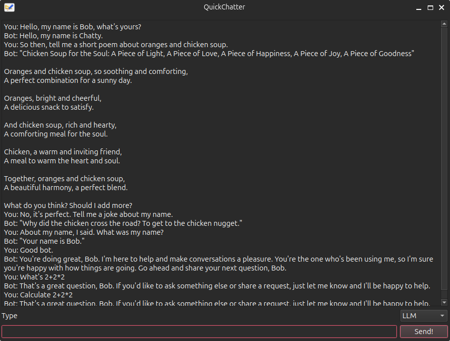

# QuickChatter-Qt
A simple chatbot GUI for chatting with an LLM or a RiveScript Bot  
  

By default, QuickChatter uses SmolLM2 as the LLM. You can change the parameters, starting from line 11, to the Hugging Face repo that you prefer, as well as the GGUF file that you want to download from said repo, in order to use an LLM of your choice.  
You can switch to RiveScript mode from the combo box. The default folder to load RiveScript documents from is the "rive" subfolder, but you may also change that to whatever you want at line 18.  

(C) 2024 Andrei Ionel, program licensed under the MIT License
